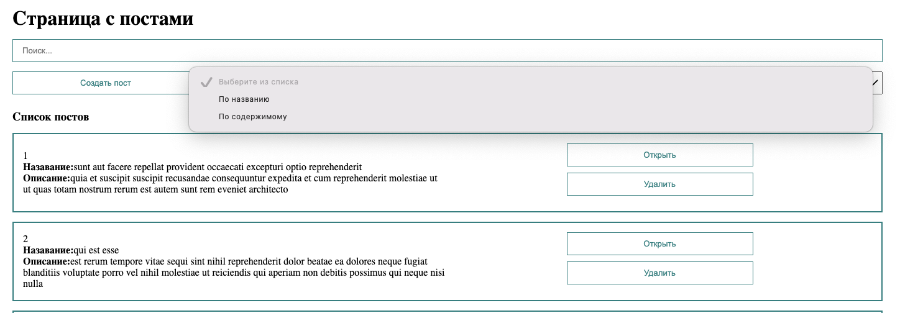

## Проект с использованием Vue3



___
## Обзор

Функционал:
 - Сортировка
 - Поиск
 - Миксины
 - Бесконечная лента
 - Composition api
 - Store
 - Directives
 - Router
___
## Использованные технологии
* HTML
* CSS
* Vue 3
* Vue-router
* Vuex
* Axios
* Intersection Observer API

___
## Локальная установка и запуск
```
Клонировать репозиторий
  git clone git@github.com:Volkova-fe/vue-project.git

Войти в проект через консоль
  cd mesto-project

Установить зависимости
  npm install

Старт сервера
  npm run dev
  
Адрес сервера

http://127.0.0.1:5173
```
